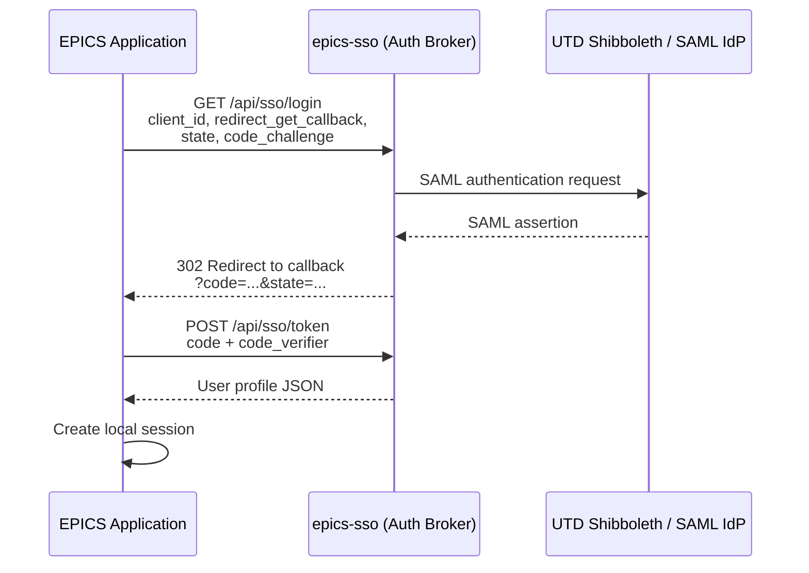

# EPICS SSO Application

epics-sso is a lightweight SAML auth broker for UTDesign EPICS applications.

## Flow



## Usage

1. The application starts by redirecting the user to `/api/sso/login` with its registered `client_id`, `redirect_get_callback`, `state`, and `code_challenge`.
2. epics-sso validates the client against its allowlist, starts the SAML login with UTD, and keeps the login transaction in memory.
3. After UTD authenticates the user, Shibboleth POSTs the SAML response to `/api/sso/callback`.
4. epics-sso verifies the transaction, issues a short-lived authorization code, and redirects the browser back to the downstream app's callback URL.
5. The downstream app sends a server-side POST to `/api/sso/token` with the `code`, `code_verifier`, `client_id`, and `redirect_get_callback`.
6. epics-sso verifies the PKCE challenge, consumes the code, and returns the user profile fields the app can use to create its own session.

## Endpoints

- `GET /api/sso/metadata` returns the service provider metadata XML.
- `GET /api/sso/login` starts the SAML sign-in flow.
- `POST /api/sso/callback` receives the SAML assertion from UTD.
- `POST /api/sso/token` exchanges a code for profile data.
- `GET /api/sso/failure` shows a generic authentication failure response.

## Minimal Nuxt App Example

### Frontend

```vue
<template>
    <NuxtLink to="/auth/login">Login with UTD</NuxtLink>
</template>
```

### Backend

```ts
// server/utils/_auth-transactions.ts
import { randomUUID, createHash } from "node:crypto"

type AuthTransaction = {
    id: string
    client_id: string
    redirect_get_callback: string
    verifier: string
    createdAt: number
}

const TTL = 1000 * 60 * 5 // 5 minutes
const store = new Map<string, AuthTransaction>()

// Remove expired transactions from the store
const cleanup = () => {
    const now = Date.now()
    for (const [id, transaction] of store) {
        if (now - transaction.createdAt > TTL) {
            store.delete(id)
        }
    }
}

export const createTransaction = (client_id: string, redirectGetCallback: string) => {
    cleanup()
    const id = randomUUID()
    const verifier = randomUUID()
    store.set(id, { 
        id, 
        client_id, 
        redirect_get_callback: redirectGetCallback, 
        verifier, 
        createdAt: Date.now() 
    })
    const code_challenge = createHash("sha256").update(verifier).digest("base64url")
    return { id, verifier, code_challenge }
}

export const consumeTransaction = (id: string) => {
    cleanup()
    const transaction = store.get(id)
    if (transaction) {
        store.delete(id)
    }
    return transaction
}
```

```ts
// server/api/auth/login.get.ts
import { createTransaction } from "#server/utils/_auth-transactions"

export default defineEventHandler(async (event) => {
    // This must match exactly what is registered in epics-sso's allowed_clients.js
    const clientId = "my-epics-app" 
    
    // base URL of your application, e.g., https://my-epics-app.utdallas.edu
    // This must match exactly what is registered in epics-sso's allowed_clients.js
    const { public: { BASE_URL } } = useRuntimeConfig(event) 
    
    // callback URL for your application, e.g., https://my-epics-app.utdallas.edu/api/auth/callback
    // This must match exactly what is registered in epics-sso's allowed_clients.js
    const redirectGetCallback = `${BASE_URL}/api/public/auth/callback`
    const transaction = createTransaction(clientId, redirectGetCallback)

    // epics-sso base URL, e.g., https://epics-sso.utdallas.edu
    const SSO_BASE = process.env.SSO_BASE
    const authorizeUrl = new URL(`${SSO_BASE}/api/sso/login`)
    authorizeUrl.search = new URLSearchParams({
        client_id: clientId,
        redirect_get_callback: redirectGetCallback,
        state: transaction.id,
        code_challenge: transaction.code_challenge,
    }).toString()

    return sendRedirect(event, authorizeUrl.toString(), 302)
})
```

```ts
// server/api/auth/callback.get.ts
import { z } from "zod"
import { StatusCodes, ReasonPhrases } from "http-status-codes"

const schema = z
    .object({
        code: z.string().min(1), 
        state: z.string().min(1) 
    })
    .strict()
    .required()

const validateQuery = (event, schema) => {
    const query = getQuery(event)
    const result = schema.safeParse(query)
    if (!result.success) {
        throw createError({
            statusCode: StatusCodes.BAD_REQUEST,
            statusMessage: ReasonPhrases.BAD_REQUEST,
            data: z.prettifyError(result.error),
        })
    }
    return result.data
}

export default defineSafeHandler(async (event) => {
    const { code, state } = validateQuery(event, schema)

    const transaction = consumeTransaction(state)
    if (!transaction) {
        throw createError({ statusCode: 400, statusMessage: "Invalid state" })
    }
    const SSO_BASE = process.env.SSO_BASE
    const profile = await $fetch(`${SSO_BASE}/api/sso/token`, {
        method: "POST",
        body: {
            client_id: transaction.client_id,
            redirect_get_callback: transaction.redirect_get_callback,
            code,
            code_verifier: transaction.verifier,
        },
    })

    /*
    Schema for profile object returned from epics-sso:
    {
        email: string
        displayName: string
        firstName: string
        lastName: string
    }

    */

    // Here you would create a local session for the user and manage sessions yourself
    // Logout should also be handled by your application, clearing the local session and redirecting to your own logout route if needed.

    return sendRedirect(event, "/whatever-page-you-want-to-redirect-to", 302)
})
```
